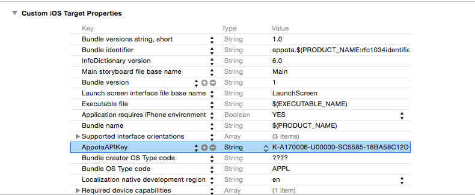

Appota iOS SDK for Advertiser
===============
This SDK is used to measure the effectiveness of your ads install and app engagement campaigns--by tracking the installs and user activity that were driven by your advertising on `ADSOTA`

## 1. Configure SDK

- Drag `AppotaAdvertiserSDK.framework` to your `XCode` project (use `Copy items into destination group's folder (if needed)` option)
- Import other required framework:  In your project app’ target settings, find Build phases and open `Link Binary with Libraries`. Click ‘+’ and choose to add these frameworks: `SystemConfiguration.framework`, `Security.framework`, `CFNetwork.framework`, `AdSupport.framework`, `CoreTelephony.framework`
- Config project linker setting: In your project `Build settings`, find `Other Linker Flags`, and add option: `-ObjC`

- Config your publishing channel in `Info.Plist`, Add publishing channel for example 
`Apple` for key `pid` in `.Plist`
- Add `AppotaAPIKey` key in `.Plist` (`AppotaAPIKey` can be retreived from Appota developer page)



## 2. Function
- In `Appdelegate` import

```
#import <AppotaAdvertiserSDK/AppotaAdvertiserSDK.h>

```

- In `AppDelegate's` method `application:didFinishLaunchingWithOptions:` call

```
	[AppotaAdvertiserSDK configure];
    
```
